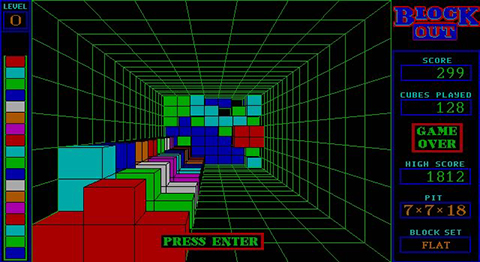
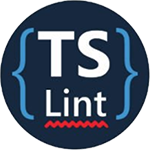

# BlockOutTS

A remake of the classic Blockout using TypeScript and the babylon.js 3D engine.


## Tech Stack
- TypeScript 3.4.5
- Webpack 4.40
- babylon.js 4.0.3
- Jest 24.9
- TypeDoc 0.14
- TSLint 5.16

<hr>

## Blockout 1989



Blockout ist ein 1989 veröffentlichtes Computerspiel der polnischen Programmierer Alexander Ustaszewski und Mirek Zabłocki, das auf innovative Weise das Prinzip des Geschicklichkeitsspiels Tetris von zwei auf drei Dimensionen erweiterte.

Der Spieler blickt von oben in einen Schacht mit rechteckigem Grundriss. Dreidimensionale, aus mehreren Würfeln zusammengesetzte Blöcke erscheinen am oberen Rand des Schachts und fallen langsam hinunter, währenddessen können sie vom Spieler um alle drei räumlichen Achsen gedreht und seitlich verschoben werden. Wie bei Tetris ist es das Ziel, die Blöcke puzzleartig in geschlossenen Schichten anzuordnen – sobald eine Ebene vollständig belegt ist, verschwindet sie, und die darüberliegenden Klötze rutschen nach. Das Spiel ist beendet, wenn die liegengebliebenen Klötze das obere Ende des Schachts erreichen.

Blockout wurde 1989 von der kalifornischen Softwarefirma California Dreams und von Rainbow Arts veröffentlicht. Es war die erste offizielle Tetris-Variante, die nicht bei Spectrum HoloByte erschien. Der Name Blockout ist ein geschütztes Warenzeichen der Computerspielefirma Kadon Enterprises aus Maryland.

Trotz der hohen Anforderungen an das räumliche Vorstellungsvermögen und der komplizierten Steuerung war Blockout kommerziell erfolgreich und hat bis heute eine Fangemeinde, die Turniere veranstaltet und sich unter anderem darum bemüht, die MS-DOS-Version des Spiels mit modernen Grafikkarten und Windows-Versionen zum fehlerfreien Laufen zu bringen.

Der positive Einfluss auf die Raumvorstellung Jugendlicher (10- bis 14-Jähriger) konnte 1993 im Rahmen einer wissenschaftlichen Studie nachgewiesen werden.

<hr>

## Installation
Der folgende Befehl installiert alle npm Pakete:

`npm install`

## npm targets


### TypeScript nach JavaScript kompilieren
`npm run typescript:compile`

Kompiliert alle TypeScript Quellcodes von `/src` nach JavaScript unter `/bin`.
 Die Einstellungen für den TypeScript Compiler befinden sich unter `/tsconfig.json`.


### Webpack in development ausführen
`npm run webpack:dev`

Gleiches Verhalten wie Target `typescript:compile`. Darübehinaus werden alle internen
 kompilierten JavaScript Dateien unter `/bin` mit allen externen JavaScript Quellcodes 
 der verwendeten Bibliotheken zusammengefügt und unter `dist/js/bundle.js` vereint.

Nach dem erfolgreichen Abschluss dieses Targets kann das fertige Frontend unter 
 `dist/index.html` betrieben oder deployed werden.

Alle Einstellungen für Webpack siedeln in der `/webpack.config.js` an.

### Webpack in production ausführen
`npm run webpack:production`

Gleiches Verhalten wie das target `webpack:development` nur dass das Kompilat unter
 `dist/js/bundle.js` minifiziert und obfuskiert wird.

### Den Webpack Dev Server starten
`npm run webpack:devserver`

Gleiches Verhalten wie das Target `webpack:development` es wird allerdings kein Output unter
 `bin` oder `dist/js/bundle.js` erstellt. Stattdessen wird die Resource `dist/js/bundle.js`
 virtuell für den Webpack Dev Server zur Verfügung gestellt und der gesamte Ordner `/dist`
 in den Webpack Dev Server gemountet.

Die in den Webpack Dev Server gemountete Frontend Anwendung kann im Browser eingesehen werden
 unter `http://localhost:5000/`

Alle Einstellungen für den Webpack Dev Server befinden sich in der `/webpack.config.js`
 im Abschnitt `config.devServer`.

Damit HTTP Requests auf die API gelingen muss die CORS-Policy deaktiviert werden.
 Dies gelingt über das Deaktivieren der Web Security des Browsers wie folgt:

```
/Applications/Google\ Chrome.app/Contents/MacOS/Google\ Chrome --disable-web-security --user-data-dir /tmp
```


### TypeDoc generieren
`npm run typedoc:generate`

Generiert eine HTML Dokumentation unter `/doc` für alle TypeScript Quellcodes unter `/src/typescript`.



### TSLint ausführen
`npm run tslint:check`

Führt den TypeScript Linter für alle Quellcodes unter `/src` aus.

Einstellungen für den Linter befinden sich unter `/tslint.json`.


### Alle TypeScript Tests mit Mocha aufrufen
`npm run test:all`

Ruft den Mocha Test Runner auf der alle definierten Tests in TypeScript Dateien unterhalb `/src/test` ausführt.
Die Konfiguration für den Testrunner wird als Parameter im Anschluß an den Befehl definiert.


### Alle TypeScript Tests mit Jest aufrufen
`npm run test:jest`

Ruft den Jest Test Runner auf der alle definierten Tests in TypeScript Dateien unterhalb `/src/test` ausführt, 
die über die Endung `.test.ts(x)` verfügen.

Die Konfiguration für Jest befindet sich in der `/package.json` im Abschnitt `jest`.

### Alle TypeScript Tests mit Jest aufrufen und Code Coverage generieren
`npm run test:jest-coverage`

Gleiches Verhalten wie das Target `test:jest` und im Anschluß wird die Code Coverage unter `/coverage` generiert.

<hr>

## Hand Outs

### Warum TypeScript?

https://blog.mayflower.de/6135-typescript.html

### Aufsetzen eines Web-Techstacks mit npm, TypeScript und Webpack

https://blog.mayflower.de/6324-typescript-tooling-npm-webpack.html

### TypeScript im Vergleich zu Java

https://blog.mayflower.de/6344-typeacript-java-entwickler.html

### TypeScript Workshop für Einsteiger

https://blog.mayflower.de/6229-typescript-workshop.html
