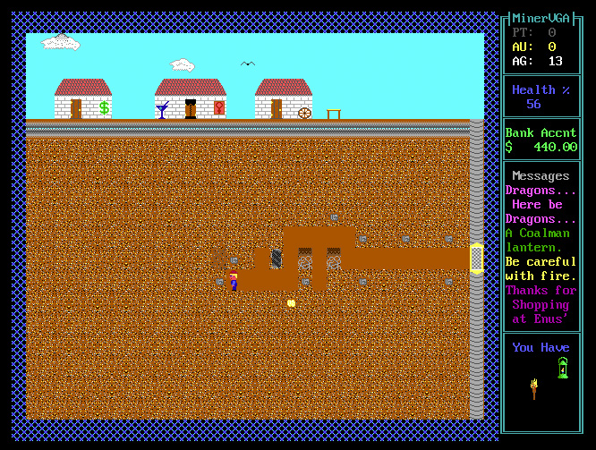

# MinerTS

A remake of the classic MinerVGA using TypeScript and the babylon.js 3D engine.

## Tech Stack
- babylon.js 4.0.3
- TypeScript 3.4.5
- Webpack 4.40
- Jest 24.9
- TypeDoc 0.14
- ESLint 6.8
- TSLint 5.16

## MinerVGA 1989

Miner is a game of rare earths mining. In the game, you assume the role of a miner in search of rare earths like silver,
 gold, and platinum. The goal is to collect enough cash to marry Mimi and retire.

### Play Online!

https://www.playdosgames.com/play/miner-vga/

## Installation

Nach dem Klones des Git Repositories installiert der folgende Befehl alle npm Pakete die der genannte Tech Stack 
 verwendet und die in der Datei **package.json** aufgelistet sind. Die in dieser Datei im Bereich **script** 
 aufgelisteten npm Targets stehen anschließend zur Verfügung.

`npm install`

## Entwicklung

Zum Bauen und Betrieben des Web-Frontends kann mit dem folgenden Befehl der Webpack Dev Server gestartet werden:

`npm run webpack:devserver`

Die gebaute und in den Webpack Dev Server gemountete Frontend Anwendung kann jetzt im Browser eingesehen werden unter:
 
`http://localhost:5000/`

Es sollte nun das folgende Frontend im Browser zu sehen sein:

Beim allen Änderungen am Projektcode baut der Webpack Dev Server das Frontend selbstständig neu und aktualisiert die
 Webseite im Browser.

